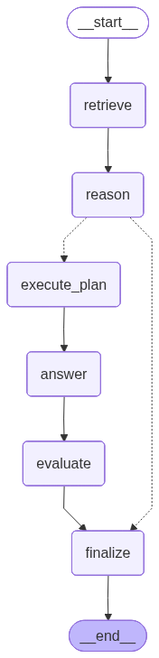

# HW4 Report — Extending a Starter Agentic System

## Overview

The starter LangGraph agent was extended with semantic vector retrieval (Part A), plan-then-execute reasoning (Part B), and an LLM-as-judge evaluation layer (Part C). All three extensions operate on the compiled graph below; the dashed edges out of `reason` represent the conditional clarification branch.

---

## Part A — Retrieval: Vector Database (ChromaDB + Sentence-Transformers)

**What was implemented.** The keyword-overlap baseline was replaced with semantic vector search using ChromaDB and `all-MiniLM-L6-v2`. A one-time ingestion script (`scripts/ingest.py`) splits the five KB Markdown files into paragraph-level chunks (min 100 chars), embeds them, and stores 36 chunks in a persistent collection. At query time, `app/tools/vector_retriever.py` performs cosine similarity search and returns top-k chunks with normalised scores. The original keyword retriever is retained as a fallback.

**Design rationale.** Keyword overlap fails when users paraphrase — "how do I get a later deadline?" shares few tokens with "extension policy." Semantic embeddings map both to the same region of vector space, making retrieval robust to vocabulary variation without a larger LLM.

**Observed results.** Across all 15 golden Q&A pairs, `citation_recall` reached **1.000** — the correct source file was retrieved in every case. `groundedness_score` averaged **0.967**, indicating near-zero hallucinated numeric values.

---

## Part B — Reasoning: Plan-then-Execute

**What was implemented.** `app/nodes/reason.py` prompts the LLM (temperature 0) to produce a structured JSON artifact containing a 3–5 step plan, assumptions, and a one-sentence decision. `app/nodes/execute_plan.py` loops through each plan step, runs a targeted vector query per step, deduplicates chunks against existing context, and logs each step as a `tool_call` in `reasoning_trace` — visible in both terminal output and the saved JSON artifact.

**Design rationale.** In the baseline, the plan was generated but never acted on. Plan-then-execute makes it functional: each step grounds the answer in step-specific evidence, which is especially useful for multi-faceted questions where a single query misses relevant chunks.

**Observed results.** For the VPN question, `execute_plan` retrieved chunks from both `it_vpn_access.md` and `it_canvas_access.md` across its steps, enriching context beyond the initial retrieval pass. Plan steps and decision records are coherent in all 15 runs.

---

## Part C — Evaluation: LLM-as-Judge + Offline Golden Dataset

**What was implemented.** `app/eval/metrics.py` includes `llm_judge()`, which prompts the local Ollama model (temperature 0) to score each (question, answer, context) triple on factuality, relevance, and citation quality (1–5 each), normalised to [0, 1]. `app/eval/online.py` merges judge scores with heuristic metrics into a unified `eval_report` persisted per run. `scripts/eval_offline.py` batches this over `data/golden/golden_qa.jsonl` (15 items) and reports aggregate means.

**Design rationale.** Heuristic metrics measure proxy signals (are numbers grounded? is a filename present?) but cannot assess semantic completeness. An LLM judge reads answer and context together and reasons about gaps — the same way a human grader would.

**Observed results.**

| Metric | Mean |
|---|---|
| citation\_recall | 1.000 |
| keyword\_hit\_rate | 0.689 |
| groundedness\_score | 0.991 |
| citation\_coverage | 0.600 |
| tool\_use\_score | 1.000 |
| **judge\_factuality** | **0.813** |
| **judge\_relevance** | **1.000** |
| **judge\_citation** | **0.840** |
| **judge\_overall** | **0.884** |

`citation_recall` and `tool_use_score` hit **1.000** on every question. `keyword_hit_rate` of **0.689** reflects `llama3.1:8b`'s tendency to paraphrase rather than quote. `citation_coverage` of **0.600** is a formatting artefact — the heuristic checks for filenames in the answer text, which disappeared after removing the Sources line from the prompt; the judge's `citation_quality` (**0.840**) is unaffected. Most notably, the judge exposed partial answers invisible to heuristics: `groundedness_score` was **1.00** yet judge `factuality` averaged **0.813**, correctly flagging that answers covered only one tier of a multi-tier policy.

---

## Example Runs

| Question | Answer (excerpt) | Citations | Judge overall |
|---|---|---|---|
| How do late submissions work? | "Submissions 25–48 hours late incur a 25% deduction from the earned score…" | policy\_late\_work.md | 0.93 |
| How do I request a deadline extension? | "Email your instructor at least 24 hours before the deadline with subject [EXTENSION REQUEST]…" | policy\_extensions.md | 0.93 |
| How do I set up VPN access? | "Go to https://my.jhu.edu, navigate to IT Downloads > Cisco AnyConnect VPN, download and connect to vpn.jhu.edu." | it\_vpn\_access.md, it\_canvas\_access.md | 0.80 |

Reasoning trace (Q1): Plan steps targeted `policy_late_work.md` → identified penalty tiers → applied deduction rules. Decision: *"The policy involves a tiered system of deductions based on time elapsed since the deadline."* Eval: Groundedness 1.00 · Tool-use 1.00 · Judge factuality 0.80 · relevance 1.00.
